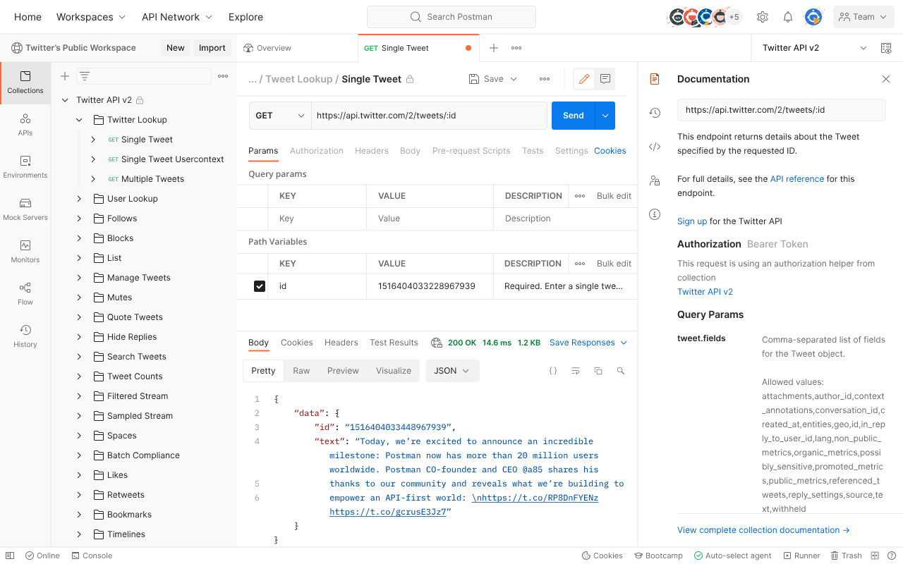

# Install Nest.js and related softwares

This document is for Linux.

Other operating system: [Windows](Tutorial-Windows.md) - [macOS](Tutorial-macOS.md)

## Table of contents

- [Install Nest.js and related softwares](#install-nestjs-and-related-softwares)
  - [Table of contents](#table-of-contents)
  - [Installation](#installation)
    - [Node.js](#nodejs)
    - [Nest.js](#nestjs)
    - [Postman](#postman)
    - [Database](#database)
  - [Next step](#next-step)

## Installation

### Node.js

[Node.js](https://nodejs.org/en) is a server environment to run application written in Javscript. Nest.js is a framework on Node.js.

To install Node.js:

- Download Node.js binaries at [https://nodejs.org/en/download](https://nodejs.org/en/download)
- Unzip the downloaded file
- Copy folders in extracted folder to `/usr`

Or install by package manager: [https://nodejs.org/en/download/package-manager](https://nodejs.org/en/download/package-manager)

After installation, verify by this command, if the versions of `npm` and `node` are displayed then the installation is success.

```sh
node --version
npm --version
```

### Nest.js

Install [Nest.js](https://nestjs.com/) by the command

```sh
npm i -g @nestjs/cli
```

After installation, verify by this command, if the version of `nest` is displayed then the installation is success.

```sh
nest --version
```

### Postman

[Postman](https://www.postman.com/) is a tool to work with APIs in order for testing and building the APIs.



To install it:

- Download the installer at [https://www.postman.com/downloads/](https://www.postman.com/downloads/)
- Unzip the downloaded file
- Create a desktop icon and save as `~/.local/share/applications/Postman.desktop` with below file content (replace `/path/to/Downloads` to the path to the folder containing extracted folder):

```txt
[Desktop Entry]
Encoding=UTF-8
Name=Postman
Exec=/path/to/Downloads/Postman/app/Postman %U
Icon=/path/to/Downloads/Postman/app/resources/app/assets/icon.png
Terminal=false
Type=Application
Categories=Development;
```

Or run the command ([Snap store](https://snapcraft.io/) is required):

```sh
snap install postman
```

Note:

- Supported Linux distributions: Ubuntu 14.04 (and newer), Fedora 24, Debian 8 (and newer).
- Permission to read/write to `~/.config` is needed for Postman to store information.
- With Ubuntu 18, please install package `libgconf-2-4` with the command `apt-get install libgconf-2-4`
- Detailed instructions: [https://learning.postman.com/docs/getting-started/installation-and-updates/#installing-postman-on-linux](https://learning.postman.com/docs/getting-started/installation-and-updates/#installing-postman-on-linux)

### Database

Nest.js applications may need to work with database. To install one of commonly used database, please refer to below links:

- MySQL: [https://dev.mysql.com/doc/mysql-installation-excerpt/8.0/en/](https://dev.mysql.com/doc/mysql-installation-excerpt/8.0/en/)
- MongoDB: [https://www.mongodb.com/docs/manual/installation/#mongodb-installation-tutorials](https://www.mongodb.com/docs/manual/installation/#mongodb-installation-tutorials)
- PostgreSQL: [https://www.postgresql.org/docs/current/installation.html](https://www.postgresql.org/docs/current/installation.html)

## Next step

[Get started with Nest.js](../Readme.en.md#get-started-with-nestjs)