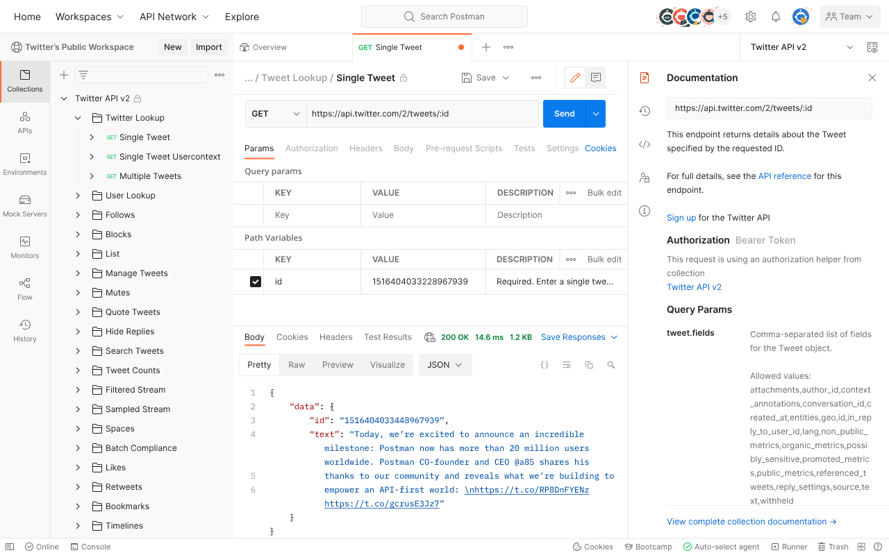

# Cài đặt Nest.js và các phần mềm liên quan

Tài liệu dành cho macOS.

Hệ điều hành khác: [Windows](Tutorial-Windows.md) - [Linux](Tutorial-Linux.md)

## Mục lục

- [Cài đặt Nest.js và các phần mềm liên quan](#cài-đặt-nestjs-và-các-phần-mềm-liên-quan)
  - [Mục lục](#mục-lục)
  - [Cài đặt](#cài-đặt)
    - [(Tuỳ chọn) Homebrew](#tuỳ-chọn-homebrew)
    - [Node.js](#nodejs)
    - [Nest.js](#nestjs)
    - [Postman](#postman)
    - [Database](#database)
  - [Bước kế tiếp](#bước-kế-tiếp)

## Cài đặt

### (Tuỳ chọn) Homebrew

[Homebrew](https://brew.sh/index_vi) là hệ thống quản lý gói phần mềm mã nguồn mở. Một số phần mềm cần được cài đặt ở các phần sau có thể được cài đặt bằng Homebrew.

Cài đặt bằng lệnh

```sh
/bin/bash -c "$(curl -fsSL https://raw.githubusercontent.com/Homebrew/install/HEAD/install.sh)"
```

### Node.js

[Node.js](https://nodejs.org/en) là một môi trường server để viết các ứng dụng bằng ngôn ngữ Javascript. Nest.js là framework chạy trên Node.js.

Để cài đặt Node.js:

- Tải Node.js installer ở [https://nodejs.org/en/download](https://nodejs.org/en/download)
- Chạy bộ cài đặt

Hoặc chạy lệnh sau (yêu cầu [Homebrew](#tuỳ-chọn-homebrew)):

```sh
brew install node
```

Sau khi cài đặt, kiểm tra bằng lệnh sau, nếu hiển thị các phiên bản của `npm` và `node` thì việc cài đặt thành công.

```sh
node --version
npm --version
```

### Nest.js

Cài đặt [Nest.js](https://nestjs.com/) bằng lệnh

```sh
npm i -g @nestjs/cli
```

Sau khi cài đặt, kiểm tra bằng lệnh, nếu hiển thị phiên bản của `nest` thì cài đặt thành công.

```sh
nest --version
```

### Postman

[Postman](https://www.postman.com/) là công cụ để thao tác với API, nhằm mục đích kiểm thử và xây dựng API.



Để cài đặt công cụ:

- Tải installer ở [https://www.postman.com/downloads/](https://www.postman.com/downloads/)
- Giải nén file đã tải
- Chạy file đã giải nén

Hoặc sử dụng lệnh (yêu cầu [Homebrew](#tuỳ-chọn-homebrew)):

```sh
brew install --cask postman
```

### Database

Các ứng dụng Nest.js có thể cần làm việc với cơ sở dữ liệu. Để cài đặt một số cơ sở dữ liệu thông dụng, vui lòng tham khảo các liên kết sau:

- MySQL: [https://dev.mysql.com/doc/mysql-installation-excerpt/8.0/en/](https://dev.mysql.com/doc/mysql-installation-excerpt/8.0/en/)
- MongoDB: [https://www.mongodb.com/docs/manual/installation/#mongodb-installation-tutorials](https://www.mongodb.com/docs/manual/installation/#mongodb-installation-tutorials)
- PostgreSQL: [https://www.postgresql.org/docs/current/installation.html](https://www.postgresql.org/docs/current/installation.html)

## Bước kế tiếp

[Băt đầu sử dụng Nest.js](../Readme.md#bắt-đầu-sử-dụng-nestjs)